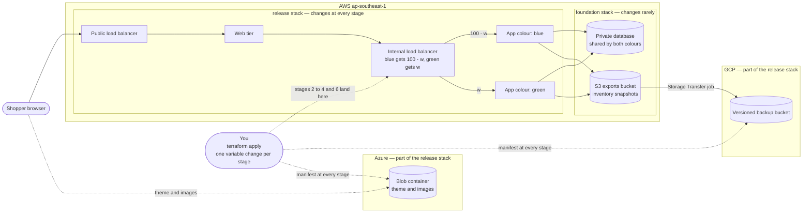

# Capstone — Terraform Shop: a Zero-Downtime Release Platform

In the training stages you learned Terraform one concept at a time. In this capstone you use all of it on one project: a small online shop, the **Terraform Shop**, which you build on AWS, release three versions of to live traffic without a single failed checkout, roll back by changing one variable, and back up off-site to GCP without storing a key anywhere.

You are expected to use AI assistance, and you must record how you used it. So the project is marked on what an assistant cannot do for you: proving that the platform behaves, reading plans critically, catching defects in generated code, and explaining your own design to a panel.

This is a standalone project. It follows the training stages; the stages do not depend on it.

| | |
| --- | --- |
| Effort | About 14–18 hours of hands-on work, over several sittings |
| Clouds | AWS `ap-southeast-1` for the platform, GCP for the backup, Azure for the shop's theme and images |
| Terraform | 1.11 or later, pinned |
| You hand in | A repository, plus `evidence.md`, `design-note.md` and `ai-review-log.md` |
| You are marked on | A 100-point rubric, confirmed in a presentation |
| Running cost | About $0.24 an hour while the stack is up (see "Time, cost and teardown") |

## Before you start

- Finish the twelve training stages. This project assumes everything they teach.
- You need your AWS, GCP and Azure sandbox access and the toolchain from the first stage.
- You need an S3 state bucket with native locking. Use the one from the remote-state stage if you still have it; otherwise build it again the same way. It must not carry the project's `app = shop` tag, because the teardown scan looks for that tag.
- The trainer supplies a `data/` folder. You use it as it is; you do not write the application.

| Supplied in `data/` | What it is |
| --- | --- |
| Boot-script templates | One for the Web tier and one for the App tier |
| Three App versions | **v1** is the first release. **v2** adds a nullable column to the database and must be safe when two servers start together. **v3** passes its health check but fails every order |
| `seed.sql` | The twelve shop items, each with a high starting stock that is never reset by a second run |
| Theme and images | Assets for the Azure container |
| `probe.sh` | A client that sends steady requests and logs the status and the version that answered |
| `bad.tfvars` | A deliberately invalid variable file for the failure proofs |
| `check.sh` | The rule checker described under "Rules your code must follow" |

Every App response reports its `version`, `color` and `server`, and the shop footer shows which App server answered.

## What you will build

Shoppers reach the Web tier through a public load balancer. The Web tier calls one of two App colours, blue or green, through an internal load balancer. Both colours share one private database. Each App server writes snapshots of the item inventory, including stock, to an S3 exports bucket, and a Google Storage Transfer job copies them to a versioned bucket in GCP. The browser loads the shop's theme and images from Azure. At every stage a release manifest is published to both GCP and Azure.

In the diagram `w` is the variable `green_weight`. The diagram shows what must exist and where each stack's responsibility ends. It does not show how you build it.

**Two stacks.** A release must never touch the network, the instance roles or the database, so they live in a separate, rarely changed stack.

| Stack | Holds | Reads from |
| --- | --- | --- |
| `foundation` | Network, security groups, the Web and App instance roles, the database, the S3 exports bucket | Nothing |
| `release` | Public and internal load balancers, the Web tier, both App colours, the alarms, the GCP bucket and transfer job, the AWS role the transfer job uses, the Azure storage, the manifest | The `foundation` outputs |

Each stack has its own state, separately for `dev` and `prod`. Build the code from local modules, one per concern: network, instance roles, database, Web tier, App tier, one App colour, cloud storage, and — added in day-2 task 3 — alarms. Every module has typed, validated inputs and documented outputs.

## What the platform must achieve

| Requirement | What it means | How it is checked |
| --- | --- | --- |
| Zero downtime | No failed checkout during any stage that is meant to be safe (stages 0 to 4 and 6) | `probe.sh` logs show zero failed requests |
| One-step rollback | Rolling back is one variable change | Stage 6 |
| One colour replaced at a time | A version change affects only the colour whose version changed | The stage 1 and stage 5 plans |
| The Web tier never changes in a release | No release input reaches the Web tier | Every release plan shows zero Web changes |
| No gap during replacement | New servers are healthy before old ones leave | Probe logs during stages 1 and 5 |
| One database for both colours | v1, v2 and v3 all work against the same schema, and two colours starting together cannot race | Stage 1 and the stock checks |
| A bad release that health checks miss | v3's failures are detected by something other than `/health` | Stage 5: a 5xx alarm and the probe's per-version failures |
| Releases never touch network, roles or database | Enforced by the two-stack split | Every release plan |
| No stored keys | AWS access uses instance roles; Google's transfer service reaches AWS through a web-identity role; no key exists in code, state or boot scripts | `check.sh` and proofs A to E |
| Reproducible stages | Each stage is one variable change, saved as a plan file | The `evidence/` folder |

## Inputs and guardrails

Bad input must fail at plan time with a message that states the problem and the allowed values. Rules that involve more than one variable are checked for the plan as a whole, so a failing plan stops before any change and reports every broken rule together.

| Variable | Allowed |
| --- | --- |
| `env` | `dev` or `prod` |
| `green_weight` | 0, 10, 50 or 100 |
| `blue_version`, `green_version` | `v1`, `v2` or `v3` |
| `blue_count`, `green_count` | Whole numbers from 0 to 4, totalling at least 2 so the footer can show which App server answered |
| `web_count` | Whole number from 2 to 4 |
| `instance_types` | A map with exactly the keys `web`, `blue` and `green`; each value `t3.micro` or `t3.small` |
| `db_instance_class` | `db.t4g.micro` or `db.t4g.small` |
| `vpc_cidr` | A valid CIDR block of size `/16` |
| `export_interval_minutes` | Whole number from 5 to 60 |
| `backup_interval_hours` | Whole number from 1 to 24 |
| `release_stage` | One of the seven stage names below; the manifest records it |

A colour with a non-zero weight must have at least one instance. This rule is the distinction proof (D) in the failure proofs.

## The release plan

Run the stages in order, on `dev`, with `probe.sh` running in a second terminal. Each stage is one small variable file applied on top of the environment file. Save the plan, keep its summary line, apply the saved plan, and confirm the result before you move on. The provider can return before servers have finished being replaced, so confirm that replacement has finished and the targets are healthy before the next change.

| Stage | Variables | The plan must show | Confirm before moving on |
| --- | --- | --- | --- |
| 0. Baseline | `web_count = 2`, `blue_version = v1`, `blue_count = 2`, `green_count = 0`, `green_weight = 0` | Everything created; green exists with no instances | All Web, blue and green targets healthy; the shop loads in a browser; the probe shows zero failures |
| 1. Warm green | `green_version = v2`, `green_count = 2` | Only green compute changes | Green targets healthy; the probe shows only v1 |
| 2. Canary | `green_weight = 10` | Traffic weights only | The probe shows v1 and v2, about 1 request in 10 on v2, zero failures |
| 3. Half and half | `green_weight = 50` | Traffic weights only | About half on each version; the orders statistics show orders from both versions |
| 4. Cutover | `green_weight = 100` | Traffic weights only | Every probe response is v2; blue is still running |
| 5. Bad release | `blue_version = v3`, `green_weight = 90` | Only blue compute and the weights change | Replacement has finished; probe failures appear on v3 only; the 5xx alarm is in ALARM, and you save its state |
| 6. Rollback | `green_weight = 100` | Traffic weights only; no instance replaced | Failures stop within one probe cycle |

Every stage also publishes a new release manifest to GCP and Azure, so each plan also shows the manifest changing. Read "traffic weights only" as: no compute, network or Web-tier change. The manifest versions on GCP are part of your evidence.

## Day-2 round

Each task starts from the end of stage 6: green runs v2 and takes all traffic, and blue runs v3 and takes none.

| Task | Change | What you must show |
| --- | --- | --- |
| 1. Scale out | `green_count = 3` | A plan with one in-place change to green's capacity; the footer shows a third App server; the probe shows zero failures |
| 2. Resize without downtime (D) | Change both colours' instance sizes without a failed request. Blue still runs v3, so repair it while it is idle before you resize | Every plan changes one idle colour only; the probe shows zero failures throughout |
| 3. Move and rename safely | Move the alarms into their own module, and rename one resource inside the colour module, using the declarative refactoring from the refactoring stage | A plan with 0 to add, 0 to change and 0 to destroy |
| 4. Adopt a hand-made alarm | Create an alarm named `shop-dev-web-5xx` in the console, then bring it under Terraform with an import and generated configuration, and tidy the result | One import, then a second plan that reports no changes |
| 5. Catch drift | Change the traffic weights by hand in the console, then detect and reconcile the difference | The refresh-only plan that shows the drift, and a final clean plan; say which side was right and why |

## Proofs you must submit

Save each proof in `evidence.md` as the command you ran and its output. The failure proofs run before the first apply of the environment.

**Failure proofs — plan time, nothing created**

| Proof | What it must show |
| --- | --- |
| 1. Supplied file | Planning with `data/bad.tfvars` exits with an error and at least three `Invalid value for variable` messages, each stating the allowed values, and writes no plan |
| 2. Invalid network | A `/24` is rejected by the size rule, and a malformed address such as a `/33` is rejected as not a CIDR block |
| 3. Disallowed size | A disallowed instance type and a disallowed database class are each rejected with the allowed values in the message |
| (D) Weight without instances | A weight above zero on a colour with no instances stops the plan and names the colour |

**Identity and backup proofs.** Open sessions without SSH.

| Proof | Where | What it must show |
| --- | --- | --- |
| A. App role works | An App server | The caller identity is the App role, and the server can write under `exports/` in the exports bucket |
| B. App role is limited | An App server | Writing anywhere else in the exports bucket, and to the state bucket, is denied |
| C. Web role has no S3 | A Web server | The same write is denied |
| D. Backup lands in GCP | Your workstation | At least one inventory snapshot in the backup bucket; its name and size match the S3 object and its item count equals what the shop's product list returns |
| E. Transfer role is limited | Your workstation, read-only | Only Google's transfer service account can assume the AWS role, and it can only list the exports bucket and read the `exports/` objects |

Proof D needs a snapshot and a transfer run to exist, so run it after the first hour of the stack's life. Leave the proof A object where it is; teardown removes it with the bucket.

**Stock checks**

- At the end of stage 3, the stock removed from all items equals the units in the orders placed by v1 and v2 together.
- After the stage 5 failure run, stock has not moved for the failed orders.
- The latest GCP snapshot shows stock values that match the product list at the time of the export.

## Rules your code must follow

`check.sh` reads the plan JSON and the AWS CLI and fails a submission that breaks any of these.

| Rule | What is inspected |
| --- | --- |
| Pinned versions | `required_version` is 1.11 or later; `aws`, `google`, `azurerm` and `random` have version constraints; both stacks commit their lock files |
| Tagging | `default_tags` with `app`, `env`, `owner` and `managed_by`; every planned AWS resource carries them |
| Naming | Resource names follow `<app>-<env>-<resource>`, with `app` set to `shop` |
| Ingress | No ingress from `0.0.0.0/0` except the public load balancer |
| No SSH | No rule that includes port 22, and no key pair |
| Private database | Not publicly accessible, and its subnets have no route to the internet or the NAT gateway |
| IAM | No wildcard action or resource in a customer-managed policy, no administrator attachment |
| No static credentials | No IAM user or access key, no Google service-account key, no access key on the transfer job |
| Colours | The colour module is called with `for_each` |
| State | S3 backend with native locking and no DynamoDB table |
| No hard-coded location | No literal region, zone name or CIDR block outside variable files and backend files |

Beyond `check.sh`:

- Every resource carries `app = shop` — as a tag on AWS and Azure and as a label on the GCP bucket — so the teardown scan can find it. The Google transfer job cannot carry labels, so its description starts with `shop-`.
- Bucket and storage-account names are global across every customer of a cloud. Make yours unique, and remember that Azure storage-account names cannot contain hyphens.
- Releases are Terraform only. Do not use `-target`, do not change anything in a console except in day-2 tasks 4 and 5, and never edit state by hand.
- Sandbox-compatible tooling only: no policy-as-code engines, HCP Terraform, Stacks, Packer, Kubernetes providers, `terraform test` or CI/CD pipelines.
- `check.sh` cannot see `-target` or console changes. They are caught by the clean plan after every stage and by questions in the presentation.

## What you hand in

| File or folder | What it holds |
| --- | --- |
| `foundation/`, `release/`, `modules/` | The two stacks and their local modules |
| `envs/` | `dev` and `prod` variable files and a backend configuration file for each stack and environment |
| `stages/` | One variable file per stage, release variables only |
| `evidence/` and `evidence.md` | Saved plans, probe logs and command output, and the file that ties each proof, stage and day-2 task to them |
| `design-note.md` | Your decisions and trade-offs: where the stack boundary sits, how the modules divide, how a release replaces a version, what decides a server is ready, how a bad release is detected, how credentials reach each hop, and why. It also holds your own cost estimate — every billed resource, its hourly rate and the hours you expect it to run |
| `ai-review-log.md` | Where you used AI, what it produced, the defects you found in it and fixed, and what you rejected. Defects of the kinds `check.sh` looks for are the obvious ones to catch: over-broad IAM, open ports, `count` where `for_each` was needed, a reachable database, missing default tags |
| `data/` | Untouched |

## Time, cost and teardown

Plan for about 14–18 hours. A focused attempt in one working window costs about $2.20, and a stack left up for 24 hours about $5.80 (about $0.24 an hour on `t3.micro` and $0.32 on `t3.small`). These are planning figures for `ap-southeast-1` and have not been re-verified, so check your own estimate against the AWS Pricing Calculator. The NAT gateway and the two load balancers are the biggest items. A version change briefly doubles one colour's servers, and day-2 task 1 adds a third server, so both add a little.

Destroy the stack the same day you build it. If you work in more than one sitting, destroy between them.

- Stop the probe, destroy `release`, then destroy `foundation`, then run `check.sh --teardown`.
- Destroy must complete in one pass. If it fails, fix it in Terraform and run it again; never delete in a console.
- Then scan all three clouds for anything left:

| Cloud | Read-only scan | Caveat |
| --- | --- | --- |
| AWS | Resources tagged `app = shop` in `ap-southeast-1` | The tagging service lags after deletion, so retry for a few minutes; check IAM roles separately, because it lists IAM only in `us-east-1` |
| GCP | Buckets labelled `app = shop`, and transfer jobs whose description starts with `shop-` | Transfer jobs have no labels |
| Azure | Resources tagged `app = shop` | The provider has no default tags, so set tags on every resource |

## If the sandbox blocks something

Tell the trainer before you change scope. These are the agreed fallbacks, and each waives the proofs it makes impossible.

| Blocked | Fallback | Waived |
| --- | --- | --- |
| Creating roles or instance profiles | The trainer supplies the Web and App profile names; the instance-role module and the transfer role are skipped | Proofs D and E; A to C cover only what the supplied profiles allow |
| The Storage Transfer API or web-identity roles | Keep the GCP bucket and the manifest; drop the transfer job | Proofs D and E |
| Load balancers, Auto Scaling or Session Manager through the NAT gateway | Fixed servers behind the load balancers | Day-2 tasks 1 and 2 |
| Anonymous Azure Blob access or a disabled GCP API | The Azure proof becomes a successful upload | The footer check |

## How you are marked

The rubric is out of 100. Items marked (D) are distinction work: the weight-without-instances proof, day-2 task 2, and applying `prod` for one hour. How they count towards a distinction, and the pass mark, are set by the trainer.

| Criterion | Points | What earns the points | Where assessors look |
| --- | --- | --- | --- |
| Provision | 15 | Both stacks apply with no manual step, and the plan after each apply is clean | Apply logs and clean plans in `evidence.md` |
| Release proofs | 25 | Stages 0 to 6 run in order. Stages 0 to 4 and 6 show zero failed requests. In stage 5 the failures are confined to v3 orders while `/health` stays healthy, and the 5xx alarm state is saved. Stage 6 rolls back with one variable and no instance replaced. Manifest versions exist on GCP for every stage. The stock checks hold | Saved plans, probe logs, the alarm state, the manifest listing |
| Structure and quality | 20 | Two stacks and local modules with typed, validated inputs and documented outputs. Colours built with `for_each`. Validation that rejects bad input with the allowed values. Pinned versions and committed lock files. `default_tags`. Two environments, `dev` and `prod`, with separate state. `check.sh` passes | The repository, `check.sh` output, failure proofs 1 to 3 |
| Day-2 round | 15 | A saved plan and the required proof for each of tasks 1 to 5. No failed requests where a probe runs. The refactor plan shows no changes. The adoption ends with a clean plan. Drift is reconciled with a reason | The saved day-2 plans |
| AI review log and design note | 15 | A design note that records real decisions and trade-offs and a cost estimate you built from rates and hours. An AI log that shows defects you actually found, fixed and rejected, compared against the PRD's common-mistake list | `design-note.md`, `ai-review-log.md` |
| Security, cost, teardown | 10 | Isolated database subnets and tier-to-tier security groups. Proofs A to E. Your cost estimate set against what you observed. A clean teardown scan in all three clouds | Proof output and scan output |

## The presentation

You present your work to a panel, from your evidence. By then the stack is destroyed, so no live cloud demonstration is needed. Plan for about 20 minutes of presenting and then questions.

The presentation carries no separate points. It is where the panel confirms the evidence behind each criterion, and a claim you cannot explain can lose the points it supports. Expect the panel to choose a stage, a day-2 task or a block of your code and ask you to explain it. Expect "what if" questions, and expect to answer without an assistant.

| Criterion | What the panel checks in the presentation |
| --- | --- |
| Provision | Both stacks applied from a clean checkout and the plan afterwards was clean. You can explain where the stack boundary sits and why a release cannot reach the network, the roles or the database |
| Release proofs | You can walk stages 0 to 6 from the saved plans and probe logs. For a stage the panel names, you say what the plan will show before you show it. For stage 5 you explain why the health check missed v3, which signal caught it, and why the rollback replaced no instance |
| Structure and quality | You can explain your module boundaries and what each module hands on, show a validation failure from your saved output, and name one design decision you would change |
| Day-2 round | You can explain each task and its plan. For the refactor, why the plan shows no changes. For the drift task, which side was right and why. For the resize, the order you changed things and why |
| AI review log and design note | You describe two defects the AI introduced that you caught, and one suggestion you rejected, with your reasoning. You answer questions about any block of your code unaided. You compare your cost estimate with what you observed |
| Security, cost, teardown | You explain the credential for each hop — instance to storage, Google's transfer service to AWS, and Terraform to each cloud — and why none of them is a stored key. You show the teardown scans from all three clouds |
