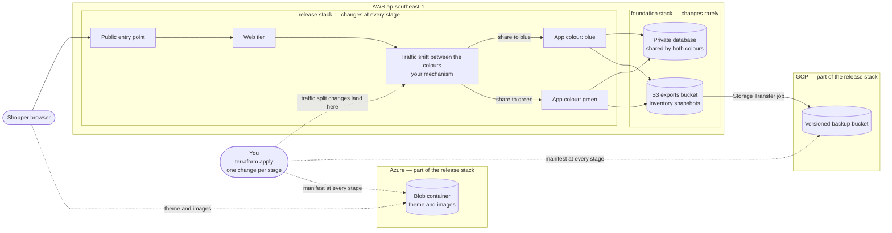

# Capstone Brief

**Builds on:** everything from M01–M12, applied to a shop of your own design.

## Objective

Design, build and release a three-tier online shop — selling whatever you choose — on AWS, on your own, with Terraform: provision it, ship three versions of it to live traffic without a single failed checkout, roll a bad release back with one change, keep an off-site copy of its inventory in GCP and serve its theme and images from Azure, all with no stored key and inside a cost ceiling, tear it all down with nothing left behind, and write the module that teaches someone else how you did it — and be able to defend every decision in it, regardless of how the code got typed.

## A note on AI-assisted development

You're expected to use AI tools for this capstone — that's realistic, not cheating. Any AI tool will do, but never paste credentials, tokens or key material into one. The bar this sets is understanding, not output:

1. **You must be able to explain any part of your work on the spot**, without looking it up or asking an AI tool again. During your presentation, your panel will pick a stage, a Demo Challenge task or a block of your code at random, ask you to walk through what it does and why, and ask you to make a small change to it live, unassisted.
2. **The design decisions are yours, not the tool's.** An AI tool can write an implementation; you decide what the shop is, what each tier runs on, how many resources there are, how the modules divide, how a release moves traffic without a failed request, what proves a server is ready, how a bad release is detected, how you demonstrate it, and how each hop gets its access without a stored key. If you can't explain *why* a decision was made, it isn't actually your decision yet — go back and make it one.
3. **Keep a short log of at least one moment an AI tool's first suggestion was wrong, inefficient, or didn't fit your design**, and what you did instead. This is part of your write-up, not optional colour — catching and correcting a bad suggestion is the actual skill being assessed here, more than the code that resulted. Defects of the kinds `check.sh` looks for are the obvious ones to catch: over-broad IAM, open ports, `count` where `for_each` was needed, a reachable database, missing default tags — and a design that quietly breaks the cost challenge.

None of this means avoiding AI tools or second-guessing every line out of caution — it means treating suggested code the way you'd treat a teammate's pull request: read it, understand it, and be ready to defend keeping it.

## Scope / topic rule (the platform is fixed, the design is yours)

You build an online shop with three tiers on AWS, released with a blue/green pattern, backed up to GCP and themed from Azure. A single stack with one bolt-on feature is not enough: the shop is two stacks, three app versions, three clouds and a release you can prove.

**What is fixed.** The list below is the same for everyone, so that the work can be compared.

- Three tiers: a public web tier, an app tier and a private database.
- A blue/green release: two colours of the app tier, with traffic moved between them in steps, and moved back to roll back.
- The GCP use case: each app server writes snapshots of the item inventory, including stock, to an S3 exports bucket, and a Google Storage Transfer job copies them to a versioned bucket in GCP.
- The Azure use case: the browser loads the shop's theme and images from an Azure blob container.
- A release manifest published to both GCP and Azure at every stage.
- The supplied application, in three versions, and the stage outcomes below.

**What is yours.** Everything under "Your design decisions" — including what the shop sells. It is one section, so you can see all of your freedom in one place.

The diagram shows what must exist and which side of the stack boundary each fixed part falls on. What each box is made of, and how many of it there are, is yours. It does not show how you build it.

**Two stacks.** A release must never touch the network, the identities or the database, so they live in a separate, rarely changed stack. The stacks are called `foundation` and `release`.

| Stack | Holds | Reads from |
| --- | --- | --- |
| `foundation` | Network, security groups, the identities the tiers run as, the database, the S3 exports bucket | Nothing |
| `release` | The public entry point, the web tier, both app colours, the traffic shift, your failure signal, the GCP bucket and transfer job, the AWS role the transfer job uses, the Azure storage, the manifest | The `foundation` outputs |

**What the trainer supplies.** A `data/` folder. You use the application as it is; you do not write it.

| Supplied in `data/` | What it is |
| --- | --- |
| The application | Three versions, as the trainer supplies them. How you package and run them on the compute you choose is part of your design. **v1** is the first release. **v2** adds a nullable column to the database and must be safe when two servers start together. **v3** passes its health check but fails every order |
| A starter catalogue | At least twelve items, each with a high starting stock that a second run never resets. You may replace the items with your own |
| A starter theme and images | Assets for the Azure container. You may replace them with your own |
| `probe.sh` | A client that sends steady requests and logs the status and the version that answered. Using it is optional (see "Demonstrating the release") |
| `check.sh` | The rule checker described under "What `check.sh` enforces" |

Every response of the application reports its `version`, `color` and `server`, and the shop footer shows which server answered.

## Your design decisions

These are yours. Nothing in this brief or in `data/` decides them, and you defend each one in your write-up and in the presentation. The limits on them are the stack constraints and the cost challenge, and nothing else.

| Decision | What is open | What stays fixed |
| --- | --- | --- |
| The shop | What it sells and what it is called — K-pop merchandise, PC parts or anything else — its items, copy and images | At least twelve items, each with a stock count; the technical name `shop` in names and tags, so the checker and the teardown scan can find everything |
| What each tier runs on | Virtual servers and which types, containers on Fargate or another way to run them, or a mix per tier, and how the supplied application is packaged and run on it | It runs the supplied application versions; it stays within the size limits of the cost challenge; no SSH |
| How many resources, and which | How many servers or tasks in each tier, how many subnets and zones, how the public entry point is built, security groups, the database engine and size, whether to use a NAT gateway or other ways out | Three tiers; the database is private; the cost challenge; the security constraints |
| Network and access | Network layout, how the tiers reach one another, how the app tier gets its database credential, how you open a session on a tier without SSH | No credential in code, variables, state or the repository; the security constraints |
| How you achieve zero downtime | What shifts the traffic, what counts as "ready for traffic", what is running before the old version leaves, how much extra capacity you spend while a release is in flight | Two colours built from one module called with `for_each`; the stage outcomes in the release plan; releases are Terraform only |
| How a bad release is detected | Which signal, other than the health check, tells you that v3 is failing, and what it measures | An automated signal; its state is saved during stage 5 |
| How a release is rolled back | The mechanism | One change, and no server or task replaced |
| How you demonstrate the release | The client, dashboard or recording you use, and how you present it | It shows every request's status and the version that answered, through all seven stages, and leaves a record the panel can inspect |
| How the code is organised | Module boundaries, what each module takes and hands on, variable and output names, how each stage's inputs are named | Two stacks with their own state, typed and validated inputs, documented outputs, one change to your release inputs per stage |
| How you stay under the cost challenge | Which trade-offs you make, and what you give up for them | The limits in the cost challenge |

## Stack constraints

Same as the rest of the course: Terraform CLI 1.11 or later at the exact version in `versions.env` (OpenTofu is not used), sandbox accounts only, short-lived sign-in only, no static credentials, sandbox-compatible tooling only, AWS first. On top of that, these are the constraints set for this capstone:

- **Tooling.** No policy-as-code engines, HCP Terraform, Terraform Stacks, Packer, Kubernetes providers, `terraform test`, paid SaaS tools or CI/CD pipelines. Never create, store or commit a static access key, service-account key or client secret, anywhere — in the repository, on disk, in state or on a server or container.
- **Clouds and region.** AWS `ap-southeast-1` for the platform, GCP for the backup, Azure for the shop's theme and images. The providers are `aws`, `google`, `azurerm` and `random`, all with version constraints, with the lock files committed in both stacks. The GCP project and the Azure subscription are set explicitly, not inferred from the active login.
- **State.** One S3 bucket with versioning, encryption at rest, blocked public access and native locking — no DynamoDB table. Use the bucket you kept from the remote-state stage; the course keeps it until the capstone ends. It must not carry the project's `app = shop` tag. Each stack has its own state, separately for `dev` and `prod`.
- **Structure.** Two stacks, `foundation` and `release`, built from local modules with typed, validated inputs and documented outputs. The two colours are built from one module called with `for_each`. Formatting and validation checks pass.
- **Releases.** A release is Terraform only: one change to your release inputs per stage, saved as a plan file and applied from that file. No `-target`. No console changes, except in Demo Challenge tasks 4 and 5. Never edit state by hand. Confirm each change has fully finished — the replacement is complete and everything that serves traffic is healthy — before you start the next.
- **Names and tags.** Resource names follow `<app>-<env>-<resource>`, with `app` set to `shop` whatever the shop sells. `default_tags` carry `app`, `env`, `owner` and `managed_by`. Every resource carries `app = shop` — as a tag on AWS and Azure and as a label on the GCP bucket — so the teardown scan can find it; the Google transfer job cannot carry labels, so its description starts with `shop-`. Bucket and storage-account names are global across every customer of a cloud, so make yours unique; Azure storage-account names cannot contain hyphens.
- **Security.** No ingress from `0.0.0.0/0` except the public entry point. No SSH and no key pair; open sessions without SSH. The database is not publicly accessible and its subnets have no route to the internet or the NAT gateway. No wildcard action or resource in a customer-managed IAM policy, and no administrator attachment.
- **The supplied application.** `data/` stays untouched, except that you may replace the starter catalogue and the starter theme and images with your own.
- **Sandbox limits.** If the sandbox blocks something, tell the trainer before you change scope. The agreed fallbacks are under "If the sandbox blocks something".

### The cost challenge

Cost is part of the design. Your platform has to stay inside these limits, and the limits are what make the design decisions hard.

| Limit | Value | How it is checked |
| --- | --- | --- |
| Steady-state running cost | At most $0.30 an hour, with every billed resource at its `ap-southeast-1` on-demand rate | The panel recomputes it from your saved stage 0 plan and the rates in your write-up |
| Total spend for the capstone | Under $5, including the extra capacity while a release is in flight and any distinction work | Your estimate (rates × quantities × hours the stack actually ran, from your saved plan and apply times) |
| Compute size | No server bigger than `t3.small`. No container task bigger than 0.5 vCPU and 1 GB. No database bigger than `db.t4g.small` | `check.sh`, from the plan |
| Gateways and balancers | At most one NAT gateway and at most two load balancers | `check.sh`, from the plan |
| Teardown | Destroy the stack the same day you build it, in one pass, and never fix a failed destroy in a console | The teardown scans |

These are planning figures for `ap-southeast-1` and have not been checked against every design you might choose. Check your own estimate in the AWS Pricing Calculator. Billing APIs are not used, so the estimate is the evidence.

## Requirements (all required)

### What the platform must achieve

| Requirement | What it means | How it is checked |
| --- | --- | --- |
| Zero downtime | No failed checkout during any stage that is meant to be safe (stages 0 to 4 and 6) | Your release demonstration shows zero failed requests |
| One-step rollback | Rolling back is one change to one input | Stage 6 |
| One colour replaced at a time | A version change affects only the colour whose version changed | The stage 1 and stage 5 plans |
| The web tier never changes in a release | No release input reaches the web tier | Every release plan shows zero web-tier changes |
| No gap during replacement | New servers or tasks are healthy before old ones leave | The demonstration during stages 1 and 5 |
| One database for both colours | v1, v2 and v3 all work against the same schema, and two colours starting together cannot race | Stage 1 and the stock checks |
| A bad release that health checks miss | v3's failures are detected by something other than the health check | Stage 5: your failure signal and the failures per version |
| Releases never touch network, identities or database | Enforced by the two-stack split | Every release plan |
| No stored keys | The tiers' access uses the identities they run as; Google's transfer service reaches AWS through a web-identity role; no key exists in code, state or the application's start-up | `check.sh` and proofs A to E |
| Reproducible stages | Each stage is one change to your release inputs, saved as a plan file | The `evidence/` folder |

### Inputs and guardrails

Bad input must fail at plan time with a message that states the problem and the allowed values. Rules that involve more than one variable are checked for the plan as a whole, so a failing plan stops before any change and reports every broken rule together. The names of the variables are yours.

| Input | Allowed |
| --- | --- |
| The environment | `dev` or `prod` |
| The share of traffic sent to green | 0, 10, 50, 90 or 100 |
| The version each colour runs | `v1`, `v2` or `v3` |
| The size of each tier's compute, and the database class | Each one from a list you set, with every entry inside the cost challenge |
| How many servers or tasks each tier runs | A range you set, typed and validated, inside the cost challenge, and always at least two app servers or tasks running in total so the footer can show which one answered |
| The network address range | A valid CIDR block of size `/16` |
| How often the application exports its inventory | Whole number of minutes from 5 to 60 |
| How often the backup runs | Whole number of hours from 1 to 24 |
| The release stage | One of the seven stage names below; the manifest records it |

A colour with a non-zero share of traffic must have at least one server or task running. This rule is the distinction proof (D) in the failure proofs.

### The release plan

Run the stages in order, on `dev`, with your release demonstration running. Each stage is one change to your release inputs, applied on top of the environment's inputs. Save the plan, keep its summary line, apply the saved plan, and confirm the result before you move on. The mechanism behind each stage is yours; the outcome is not.

| Stage | The one change | The plan must show | Confirm before moving on |
| --- | --- | --- | --- |
| 0. Baseline | Create everything. Blue runs v1 and takes all traffic. Green exists but runs nothing and takes none | Everything created | Everything that serves traffic is healthy; the shop loads in a browser; the demonstration shows zero failures |
| 1. Warm green | Run v2 in green | Only green's compute changes | Green is healthy; the demonstration shows only v1 |
| 2. Canary | Send 10 percent of traffic to green | The traffic split only | The demonstration shows v1 and v2, about 1 request in 10 on v2, zero failures |
| 3. Half and half | Send 50 percent to green | The traffic split only | About half on each version; the application's order statistics show orders from both versions |
| 4. Cutover | Send 100 percent to green | The traffic split only | Every response is v2; blue is still running |
| 5. Bad release | Run v3 in blue, and send 90 percent to green | Only blue's compute and the traffic split change | Replacement has finished; failures appear on v3 only while the health check stays healthy; your failure signal has fired, and you save its state |
| 6. Rollback | Send 100 percent to green | The traffic split only; nothing replaced | Failures stop within one measurement interval of your demonstration |

Every stage also publishes a new release manifest to GCP and Azure, so each plan also shows the manifest changing. Read "the traffic split only" as: no compute, network or web-tier change. The manifest versions on GCP are part of your evidence.

### Demonstrating the release

How you show the release is yours. Use the supplied `probe.sh`, your own script, a dashboard, a screen recording, or a mix. Whatever you use must:

- run through all seven stages without a gap, so a failed request cannot hide between stages;
- record, for every request, the time, whether it succeeded and which version answered;
- leave a record the panel can inspect afterwards — a log, screenshots or a recording — in `evidence/`, because the stack is destroyed before the presentation.

### Demo Challenge (the day-2 round)

A live platform keeps changing after launch. Each task below starts from the end of stage 6: green runs v2 and takes all traffic, and blue runs v3 and takes none. Do each one with Terraform and a saved plan.

| Task | Change | What you must show |
| --- | --- | --- |
| 1. Scale out | Add one more server or task to the app tier with one change to one input | A plan with one in-place change to that colour's capacity; the footer shows another server answering; the demonstration shows zero failures |
| 2. Resize without downtime (D) | Change the compute size of both colours without a failed request. Blue still runs v3, so repair it while it is idle before you resize | Every plan changes one idle colour only; the demonstration shows zero failures throughout |
| 3. Move and rename safely | Move your failure signal into its own module, and rename one resource inside the colour module, using the declarative refactoring from the refactoring stage | A plan with 0 to add, 0 to change and 0 to destroy |
| 4. Adopt a hand-made alarm | Create an alarm in the console, named to follow your naming pattern, then bring it under Terraform with an import and generated configuration, and tidy the result | One import, then a second plan that reports no changes |
| 5. Catch drift | Change the traffic split by hand in the console, then detect and reconcile the difference | The refresh-only plan that shows the drift, and a final clean plan; say which side was right and why |

### Proofs you must submit

Save each proof in `evidence/` as the command you ran and its output, and point to it from your write-up. The failure proofs run before the first apply of the environment.

**Failure proofs — plan time, nothing created**

| Proof | What it must show |
| --- | --- |
| 1. Your invalid file | Planning with a variable file of your own that breaks the rules exits with an error and at least three messages that each state the problem and the allowed values, and writes no plan |
| 2. Invalid network | A `/24` is rejected by the size rule, and a malformed address such as a `/33` is rejected as not a CIDR block |
| 3. Disallowed size | A disallowed compute size and a disallowed database class are each rejected with the allowed values in the message |
| (D) Traffic with nothing running | A traffic share above zero on a colour with nothing running stops the plan and names the colour |

**Identity and backup proofs.** Open sessions without SSH, using whatever your compute offers.

| Proof | Where | What it must show |
| --- | --- | --- |
| A. App identity works | Inside the app tier | The caller identity is the app tier's identity, and it can write under `exports/` in the exports bucket |
| B. App identity is limited | Inside the app tier | Writing anywhere else in the exports bucket, and to the state bucket, is denied |
| C. Web identity has no storage | Inside the web tier | The same write is denied |
| D. Backup lands in GCP | Your workstation | At least one inventory snapshot in the backup bucket; its name and size match the S3 object and its item count equals what the shop's product list returns |
| E. Transfer role is limited | Your workstation, read-only | Only Google's transfer service account can assume the AWS role, and it can only list the exports bucket and read the `exports/` objects |

Proof D needs a snapshot and a transfer run to exist, so run it after the first hour of the stack's life. Leave the proof A object where it is; teardown removes it with the bucket.

**Stock checks**

- At the end of stage 3, the stock removed from all items equals the units in the orders placed by v1 and v2 together.
- After the stage 5 failure run, stock has not moved for the failed orders.
- The latest GCP snapshot shows stock values that match the product list at the time of the export.

### What `check.sh` enforces

`check.sh` reads the plan JSON and the AWS CLI and fails a submission that breaks any of these. It cannot see `-target` or console changes; those are caught by the clean plan after every stage and by questions in the presentation.

| Rule | What is inspected |
| --- | --- |
| Pinned versions | `required_version` is 1.11 or later; `aws`, `google`, `azurerm` and `random` have version constraints; both stacks commit their lock files |
| Tagging | `default_tags` with `app`, `env`, `owner` and `managed_by`; every planned AWS resource carries them |
| Naming | Resource names follow `<app>-<env>-<resource>`, with `app` set to `shop` |
| Ingress | No ingress from `0.0.0.0/0` except the public entry point |
| No SSH | No rule that includes port 22, and no key pair |
| Private database | Not publicly accessible, and its subnets have no route to the internet or the NAT gateway |
| IAM | No wildcard action or resource in a customer-managed policy, no administrator attachment |
| No static credentials | No IAM user or access key, no Google service-account key, no access key on the transfer job |
| Colours | The colour module is called with `for_each` |
| State | S3 backend with native locking and no DynamoDB table |
| No hard-coded location | No literal region, zone name or CIDR block outside variable files and backend files |
| Cost limits | Compute sizes, the database class, the NAT gateway count and the load balancer count are inside the cost challenge |

### What you hand in

Use your own GitLab repository, separate from your stage practice work, committed in stages as you build rather than as one giant commit at the end.

| File or folder | What it holds |
| --- | --- |
| `foundation/`, `release/` | The two stacks |
| `modules/` | Your local Terraform modules |
| `envs/` | `dev` and `prod` variable files and a backend configuration file for each stack and environment |
| `stages/` | One variable file per stage, release inputs only |
| `evidence/` | Saved plans, your release demonstration record and command output |
| `write-up.md` | Your filled-in `write-up-template.md`: your design decisions and your own cost estimate (every billed resource, its hourly rate and the hours you expect it to run), your AI collaboration log, and the checkpoint evidence that points into `evidence/` |
| `data/` | The application untouched; your catalogue and theme, if you replaced them |

### Time, cost and teardown

Cost is bounded by the cost challenge. The NAT gateway, the load balancers and the compute are usually the biggest items, and a version change briefly doubles one colour's servers or tasks, so count that in your estimate.

Destroy the stack the same day you build it. If you work in more than one sitting, destroy between them.

- Stop the demonstration, destroy `release`, then destroy `foundation`, then run `check.sh --teardown`.
- Destroy must complete in one pass. If it fails, fix it in Terraform and run it again; never delete in a console.
- Then scan all three clouds for anything left:

| Cloud | Read-only scan | Caveat |
| --- | --- | --- |
| AWS | Resources tagged `app = shop` in `ap-southeast-1` | The tagging service lags after deletion, so retry for a few minutes; check IAM roles separately, because it lists IAM only in `us-east-1` |
| GCP | Buckets labelled `app = shop`, and transfer jobs whose description starts with `shop-` | Transfer jobs have no labels |
| Azure | Resources tagged `app = shop` | The provider has no default tags, so set tags on every resource |

### If the sandbox blocks something

Tell the trainer before you change scope. These are the agreed fallbacks, and each waives the proofs it makes impossible.

| Blocked | Fallback | Waived |
| --- | --- | --- |
| Creating roles or instance profiles | The trainer supplies the identities for the web and app tiers; the identity and transfer-role work is skipped | Proofs D and E; A to C cover only what the supplied identities allow |
| The Storage Transfer API or web-identity roles | Keep the GCP bucket and the manifest; drop the transfer job | Proofs D and E |
| Load balancers, scaling or a way to open sessions on a tier | The trainer agrees an alternative with you; fixed numbers of servers or tasks | Demo Challenge tasks 1 and 2, and any proof that needs a session |
| Anonymous Azure Blob access or a disabled GCP API | The Azure proof becomes a successful upload | The footer check |

### Distinction work (D) — optional

Three items are marked (D): the traffic-with-nothing-running failure proof, Demo Challenge task 2, and applying `prod` for one hour. How they count towards a distinction is set by the trainer.

## Presentation (raised bar)

You present your work to a panel, from your evidence. By then the stack is destroyed, so no live cloud demonstration is needed; you may play your release demonstration record. Plan for 15 minutes of presenting and then 15 minutes of questions.

In addition to presenting, your panel will pick one or two places in your code or evidence at random and ask you to (a) explain what it does and why, and (b) make a small change to it live, without AI assistance — checked with a plan, because the stack is already gone. This isn't a gotcha — it's the actual test of whether the capstone is yours.

The presentation carries no separate points. It is where the panel confirms the evidence behind each criterion, and a claim you cannot explain can lose the points it supports. Expect "what if" questions, and expect to be asked why you chose what you chose over the alternatives.

| Criterion | What the panel checks in the presentation |
| --- | --- |
| Provision | Both stacks applied from a clean checkout and the plan afterwards was clean. You can explain where the stack boundary sits and why a release cannot reach the network, the identities or the database |
| Release proofs | You can walk stages 0 to 6 from the saved plans and your demonstration record. For a stage the panel names, you say what the plan will show before you show it. For stage 5 you explain why the health check missed v3, which signal caught it, and why the rollback replaced nothing |
| Structure and quality | You can explain your module boundaries and what each module hands on, show a validation failure from your saved output, and name one design decision you would change |
| Demo Challenge | You can explain each task and its plan. For the refactor, why the plan shows no changes. For the drift task, which side was right and why. For the resize, the order you changed things and why |
| AI review log and design note | You explain why you chose your compute, your resource counts and your release mechanism over the alternatives, and what each cost you. You describe two defects the AI introduced that you caught, and one suggestion you rejected. You answer questions about any block of your code unaided |
| Security, cost, teardown | You explain the credential for each hop — tier to storage, Google's transfer service to AWS, and Terraform to each cloud — and why none of them is a stored key. You show your cost estimate against the cost challenge and what you traded to meet it, and the teardown scans from all three clouds |

## Rubric (fixed — do not deviate from this when self-assessing)

**Scoring and pass mark.** Each criterion is scored from 0 to its points: Excellent is 80% or more of the points, Satisfactory is 50% to 79%, and Needs work is under 50%. The pass mark is **70 out of 100**, and the definition of done below must also be met — a capstone that doesn't meet it doesn't pass, whatever its score.

| Criteria | Points | Excellent | Satisfactory | Needs work |
| --- | --- | --- | --- | --- |
| Provision | 15 | Both stacks apply from a clean checkout with no manual step, and the plan after each apply is clean | Both stacks apply, but a manual step, a re-apply or a plan that was not clean was needed | A stack does not apply, or state or credentials were fixed by hand |
| Release proofs | 25 | Stages 0 to 6 run in order. Stages 0 to 4 and 6 show zero failed requests. In stage 5 the failures are confined to v3 orders while the health check stays healthy, and your failure signal's state is saved. Stage 6 rolls back with one change and nothing replaced. Manifest versions exist on GCP for every stage. Your demonstration record covers every stage. The stock checks hold | Most stages evidenced; a stage shows failed requests, or an artefact is missing (the failure signal's state, a manifest version, a stretch of the demonstration record), or the rollback took more than one change | Stages missing or out of order, no demonstration record, or releases made in a console |
| Structure and quality | 20 | Two stacks and local modules with typed, validated inputs and documented outputs. Colours built with `for_each`. Validation that rejects bad input with the allowed values. Pinned versions and committed lock files. `default_tags`. `dev` and `prod` with separate state. `check.sh` passes | The structure is mostly right with gaps: an unvalidated input, one environment only, or a `check.sh` failure left unfixed | One flat configuration, hard-coded values, or `check.sh` failing |
| Demo Challenge | 15 | A saved plan and the required proof for each of tasks 1 to 5. No failed requests where the demonstration runs. The refactor plan shows no changes. The adoption ends with a clean plan. Drift is reconciled with a reason | Most tasks done; a plan or proof is missing, or the reasoning is thin | Tasks missing, or a refactor destroyed or replaced something |
| AI review log and design note | 15 | Design decisions that are real and yours, each with the alternatives you rejected and the trade-off; a cost estimate built from rates and hours. An AI log that shows defects you actually found, fixed and rejected | Decisions recorded but thin, or an AI log that is generic | Missing, or you cannot defend what it says |
| Security, cost, teardown | 10 | Isolated database subnets and tier-to-tier security groups. Proofs A to E. Your cost estimate inside the cost challenge, recomputable from your saved plan, and set against what you observed. A clean teardown scan in all three clouds | Most controls shown; a proof or a scan is missing, or the estimate is outside a limit with a reason given | An open database, a stored key, a cost limit broken without explanation, or something left behind in a cloud |

> **Note:** your trainer confirms the Satisfactory and Needs work wording, the cost challenge figures and the distinction rule before you start. See "Still open / ask your trainer".

## Definition of done

- From a clean checkout, both stacks apply with no manual step, and the plan after each apply shows no changes.
- Stages 0 to 6 are evidenced: zero failed requests in stages 0 to 4 and 6, the stage 5 failures confined to v3 orders with your failure signal's state saved, and stage 6 rolled back with one change.
- The failure proofs, the identity and backup proofs A to E, and the stock checks all pass, and Demo Challenge tasks 1 to 5 each have a saved plan and their proof.
- `check.sh` passes, and no stored key exists anywhere.
- Your platform is inside the cost challenge: the estimate in your write-up agrees with your saved plan.
- Destroy completes in one pass, and the teardown scans show nothing left in AWS, GCP or Azure, on the same day you built it.
- You pass the live walkthrough component of the presentation — if you can't explain or change work you submitted, that part of the capstone doesn't count as done regardless of whether it applied.

## What goes into the content library

Both your working repository and your `write-up-template.md` (filled in) are the deliverable — the write-up is what the next cohort's capstone brief and training content get built from. Write it as teaching material, not a retrospective.

## Still open / ask your trainer

- Who is on your panel.
- The distinction rule for the (D) items, the confirmed Satisfactory and Needs work wording in the rubric, and the cost challenge figures.
- Where your `data/` folder is.
- Whether the sandbox allows what your design needs — roles, load balancers, scaling, containers, Storage Transfer, anonymous Blob access — and which fallback applies if it does not.
